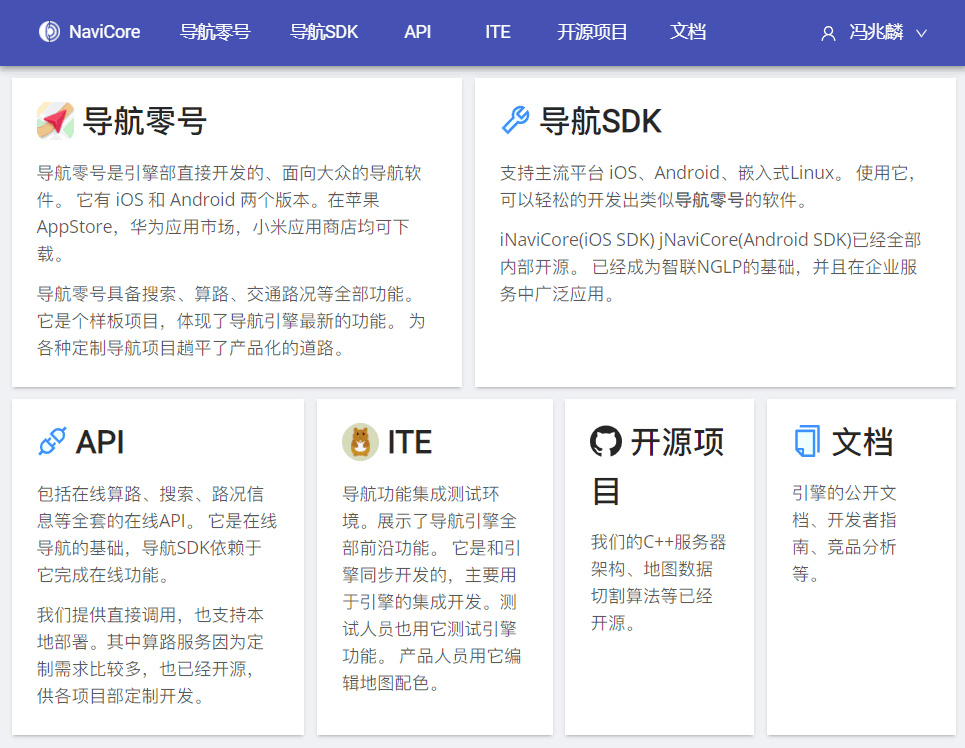
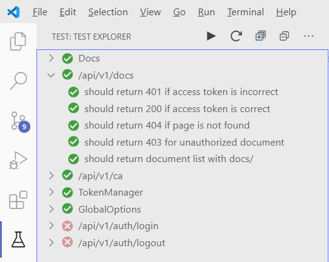
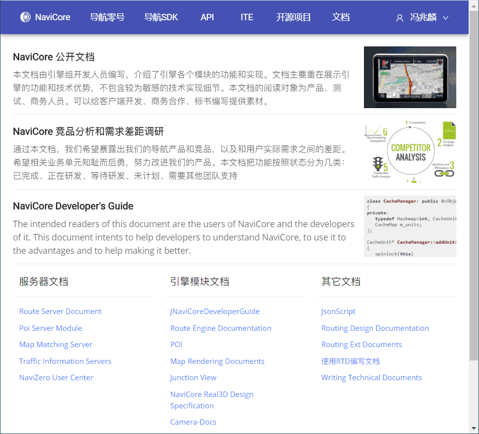

[](https://travis-ci.com/kingsimba/navicore-site-v2/)

# NaviCore Department Site

This repository is the source code of our department website: https://navicore.cn

It contains the frontend and the backend.
The backend is used for LDAP login and online document browsing.



## Main Feature

* LDAP authentication
* Online browsing of Sphinx-Docs generated documents
* Document browsing authorization

## Backend Notes

### Mocha Tests

To run mocha tests.

1. Make sure that no server is running(Stop debugging).
2. Open **Test Explorer**
3. Click **Run all tests**
   
   

4. Open ``auth.spec.ts`` and enter correct username/password information to pass all tests.

### Development Server

Open navicore-site-backend.code-workspace with VSCode.

* Press **Ctrl+Shift+B** to open **tsc watch**. (Configured in .vscode/tasks.json)
* Press F5 to run. (Configured in .vscode/launch.json)

### Production Server

Run ``npm run build`` to build the production server.
The result is in **dist/nc-site-backend.js**

### The protocol

[The backend protocol document](backend/PROTOCOL.md)

### About documents



Documents listed in this site are generated with [Sphinx](https://www.sphinx-doc.org/en/master/) with **RTD theme**.

| **NOTE**: Only tested with python 2.x and Sphinx 1.6.3

```bash
?> pip install python-sphinx
?> pip install sphinx-rtd-theme
```

Each document is build with

```
?> make html
```

The generated HTML files are put in **docs** folder. This repository already contains some sample documents in it.

## Frontend Notes

This project was generated with [Angular CLI](https://github.com/angular/angular-cli).

### Development server

Run `npm start` for a dev server. Navigate to `http://localhost:4200/`. The app will automatically reload if you change any of the source files.

``proxy.conf.js`` is used to proxy URLs start with `/api` to the backend.

### Build

Run `ng build` to build the project. The build artifacts will be stored in the `dist/` directory. Use the `--prod` flag for a production build.

### Running unit tests

Run `ng test` to execute the unit tests via [Karma](https://karma-runner.github.io).

### Running end-to-end tests

Run `ng e2e` to execute the end-to-end tests via [Protractor](http://www.protractortest.org/).

